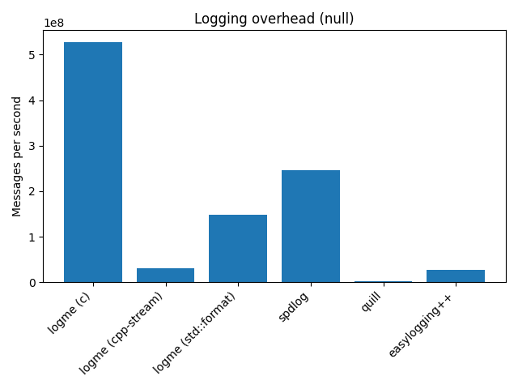
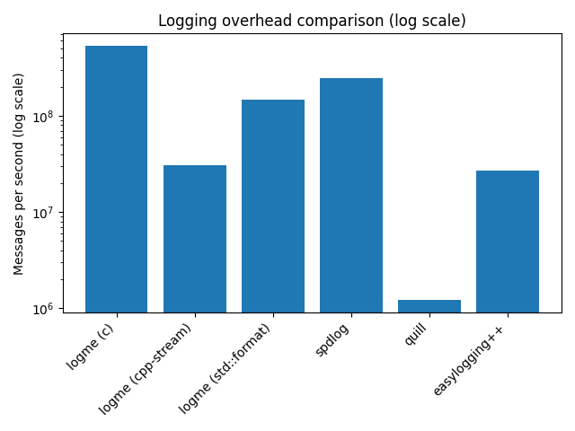
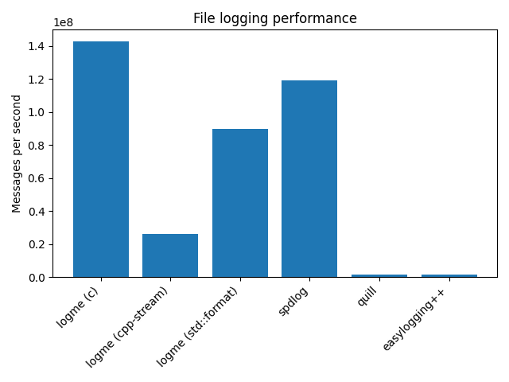
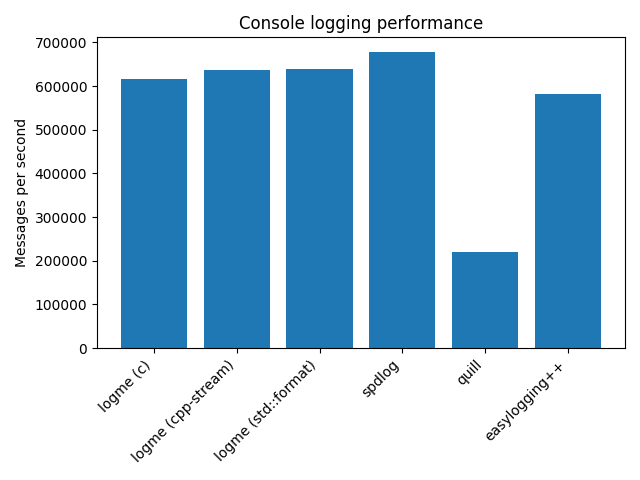
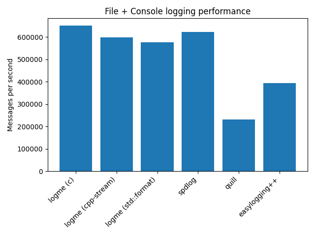

# What Does LOG_INFO() Really Cost? A Benchmark of C++ Logging Libraries

We benchmarked several C++ logging libraries to answer a simple question:

> How much does a single logging call actually cost?

Logging appears in almost every C++ project. Almost any service, daemon, or library eventually accumulates lines such as `LOG_INFO(...)` or `logger.debug(...)`.

Most of the time, a logging library is chosen based on habit, ecosystem, or popularity — `spdlog`, `quill`, `easylogging++`, and others. Much less often, developers actually measure what price the application pays for logging.

In high-load systems, logging can happen:

- millions of times per second
- from multiple threads
- with string formatting
- with output to a file or console

At that point, the logging library becomes part of the **critical execution path**.

To get a more concrete answer, we wrote a small benchmark.

The benchmark source code is available here:

https://github.com/efmsoft/logbench

Anyone can build it and reproduce the results.

## What is being tested

The benchmark measures the **maximum number of log messages per second**.

Four scenarios are covered:

| Scenario | Description |
|---|---|
| `null` | Logging is disabled at runtime |
| `file` | Messages are written to a file |
| `console` | Messages are written to the console |
| `file + console` | Messages are written to both file and console |

The `null` scenario is especially interesting.

It shows the **cost of the logging call itself** when the message is not actually written anywhere.

In other words, it measures library overhead.

## Which libraries were benchmarked

The following libraries were included in the benchmark:

- `logme` — https://github.com/efmsoft/logme
- `spdlog` — https://github.com/gabime/spdlog
- `quill` — https://github.com/odygrd/quill
- `easylogging++` — https://github.com/amrayn/easyloggingpp

For `logme`, several formatting APIs were also tested separately:

- C-style (`printf`-like)
- `std::format`
- iostream

This makes it possible to look separately at the cost of formatting and to understand how much the API choice affects the final result.

## Test system configuration

The benchmark was run on the following system:

- **CPU**: 13th Gen Intel(R) Core(TM) i9-13900HX (2.20 GHz)
- **OS**: Windows 11 Home
- **Version**: 25H2

The results shown below were obtained using a **Release** build of the benchmark.

## Test conditions

To keep the comparison as fair as possible, all libraries used a **minimal output format**.

Fields that are often present in real systems were intentionally excluded:

- timestamps
- thread id
- log level
- logger name

The goal was to reduce the effect of formatting and auxiliary work and make the test conditions between libraries as close as possible.

## Benchmark parameters

By default, the benchmark runs with the following parameters:

```text
--seconds=3
--repeat=5
--warmup-ms=300
--pause-ms=250
```

For more stable results, we recommend using:

```text
--seconds=15
```

Each test is executed multiple times, and the **median** value is used as the final result.

## Results

| Library | null | file | console | file+console |
|---|---:|---:|---:|---:|
| logme (c) | 527280306 | 142808726 | 615908 | 650303 |
| logme (cpp-stream) | 30875385 | 26293202 | 637631 | 596787 |
| logme (std::format) | 148024581 | 89936987 | 640175 | 575164 |
| spdlog | 245775694 | 119288244 | 677708 | 621846 |
| quill | 1225050 | 1620915 | 219747 | 231010 |
| easylogging++ | 26779465 | 1654775 | 581394 | 394377 |

## Why the null benchmark matters

At first glance, the `null` scenario may seem unimportant: if logging is disabled, why measure it at all?

In practice, this case is often critical. In many projects, logging calls are present everywhere, while actual output depends on the current logging level. For example:

```cpp
LOG_DEBUG("Request id={}", id);
```

Even if the `DEBUG` level is disabled, the library may still need to do some work:

- check the logging level
- prepare arguments
- perform part of the internal processing

If this path is implemented inefficiently, **even disabled logs can noticeably affect application performance**.

## What “null” means in this benchmark

One important clarification: the `null` scenario **does not mean compile-time removal of logging calls** such as via `#define`.

This benchmark measures the case where the logging call still happens, but the message is not written anywhere:

- in `logme`, the channel has no backends
- in `spdlog`, the logger has no sinks

So the benchmark measures the internal overhead of the logging library itself.



This chart shows the cost of the logging call when output is disabled.
The gap between libraries is very large.
To make the scale easier to see, it is also useful to look at the same data on a logarithmic axis.



Here it becomes clear that the difference approaches two orders of magnitude.
That means that even disabled logging can still have a measurable cost.

## File benchmark



Intuitively, one might expect that once messages are written to a file, the difference between libraries would mostly disappear because I/O should dominate the cost.

The results show that this is not the case.

Library architecture still matters, including:

- buffering
- locking
- write strategy
- backend organization

## Console benchmark



When writing to the console, the differences become smaller.

The reason is straightforward: **the console itself becomes the bottleneck**.

As a result, most libraries end up with broadly similar numbers.

## File + Console benchmark



The combined scenario shows roughly the same pattern.

Once console output is part of the path, it starts to limit overall performance.

## Impact of formatting

For `logme`, we also measured how much the formatting API affects throughput.

| API | file msgs/sec |
|---|---:|
| C-style | 19M |
| std::format | 6.7M |
| iostream | 4.1M |

The result is straightforward:

- `std::format` is about 3× slower in this test
- iostream is about 4–5× slower

Formatting can easily dominate the total logging cost.

## Why the results differ

Logging performance depends on several factors.

### Library architecture

Libraries may use:

- mutexes
- lock-free queues
- buffering

Each approach comes with its own trade-offs.

### Logging level check

The best case is when the level check happens as early as possible.

### String formatting

Formatting is often one of the most expensive parts of the logging path.

### Output buffering

If every message is written immediately, performance is usually much worse.

## Why your numbers may differ

This benchmark is sensitive to:

- CPU
- file system
- terminal
- compiler
- optimization settings

So the absolute numbers may change.

However, the relative picture often remains similar.

## How to reproduce the benchmark

```bash
git clone https://github.com/efmsoft/logbench
```

```bash
cmake -B build
cmake --build build --config Release
```

```bash
logbench --seconds=15
```

## Summary

Several observations stand out:

1. The cost of logging can differ by orders of magnitude.
2. Even disabled logs may still have noticeable overhead.
3. Formatting affects performance more than is often expected.
4. Library architecture still matters even when writing to a file.

Overall, the strongest results in this benchmark were shown by **logme** and **spdlog**.

- `spdlog` delivers consistently strong results across all scenarios.
- `logme` shows extremely low logging-call overhead and significantly outperforms other libraries in some tests.

The difference is especially visible in the `null` scenario.

It is also worth noting that `logme` supports multiple formatting APIs (`C-style`, `std::format`, and iostream), which makes it possible to choose a trade-off between convenience and performance depending on the use case.

## Conclusion

Logging is rarely treated as part of the critical execution path.

In high-load systems, however, it can significantly affect performance.

That is why it can be useful to run a simple benchmark and measure how much logging actually costs in your own application.
